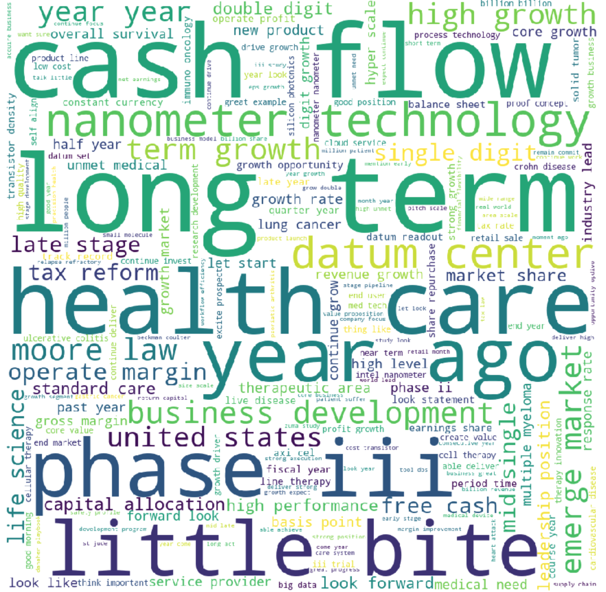

## NLP Sentiment Analysis on Transcripts Data

## 1. Problem Identification

#### 1.1. Background: Corporate Transcripts

*[S&P Global](https://www.spglobal.com/marketintelligence/en/documents/spglobal_transcripts-textual-data-analytics-brochure.pdf) provides unstructured textual data in machine-readable format with metadata tagging for quicker analysis. The transcripts of call data range from earnings, M&A, guidance to special calls and conferences.

With rapid development in Natural Language Processing field, more sophisticated tools have been introduced, such as SpaCy, Gensim, BERT and a plethora of sentiment analysis packages in NLTK (Vader, etc). This project takes advantage of the recent breakthrough in NLP and applies the technique on the transcripts data offered by S&P Global from 2017 to 2018. [NLP](https://en.wikipedia.org/wiki/Natural_language_processing)*

#### 1.2 Problem Statement

In this project, my goal is to create a trading strategy based on the sentiment analysis on company's transcripts.

## 2. Data Wrangling

#### 2.1. Data Collection

The NLP dataset contains S&P 100 companies' transcripts data from 2017 to 2018. The schema of the dataset is straightforward: companyID, date, and textual content. The stock data is obtained through Yahoo Finance Python API. 

#### 2.2. Data Definition

I investigated the below features with the help of info(), describe(), and panda profiling. 

    1.	Column Name
    2.	Data Type (numeric, categorical, timestamp, etc)
    3.	Description of Column
    4.	Count or percent per unique values or codes (including NA)
    5.	The range of values or codes

## 3. Data Cleaning

* **Problem 1:** Handling missing data. **Solution:** there is no missing data in the datasets. 

* **Problem 2:** Removing duplicates. **Solution:** use the built in Pandas DataFrame function drop_duplicates(). 

## 4. Pre-processing and Feature Engineering

    •	Create dummy or indicator features for categorical variables
    •	Standardize the magnitude of numeric features: minmax or standard scaler
    •	Split into testing and training datasets

## 5. Exploratory Data Analysis

#### 5.1 **pyLDAvis:** 
* LDA(Latent Dirichlet Allocation) assumes documents produced from a specific topic follow their own probability distribution of words. Given a dataset of documents, LDA backtracks and analyzes the underlying words discribution to figure out what topics would create those documents. Here I use the popular pyLDAvis to present 10 topics embedded in transcripts data.

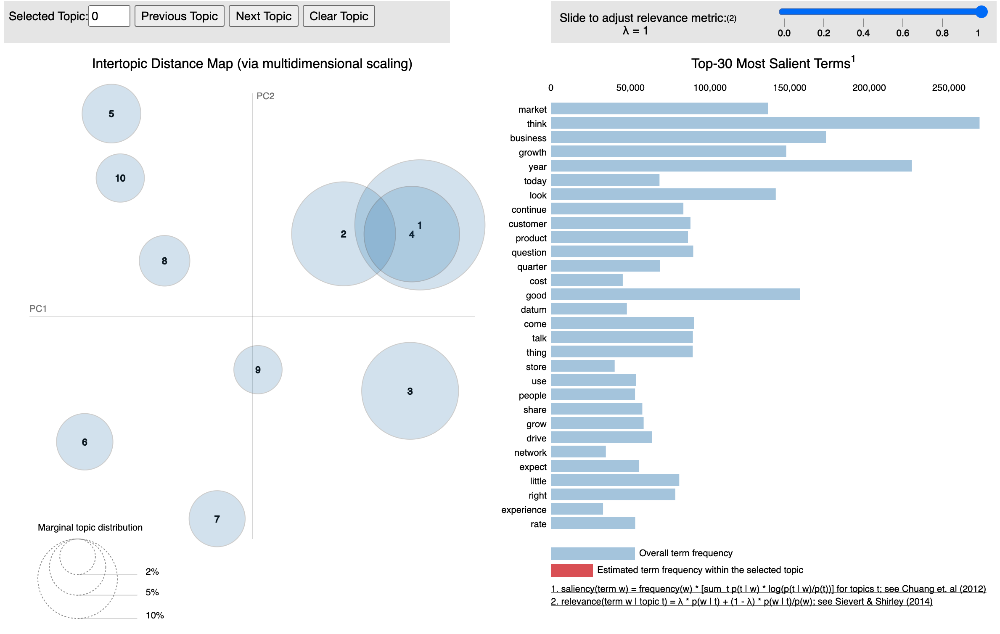

#### 5.2 **t-SNE:** 
* t-SNE(t-Distributed Stochastic Neighbor Embedding), similar to PCA, is a technique for dimensionality reduction that is particularly well suited for the visualization of high-dimensional datasets. Below is the application of visualizing 10 topics:

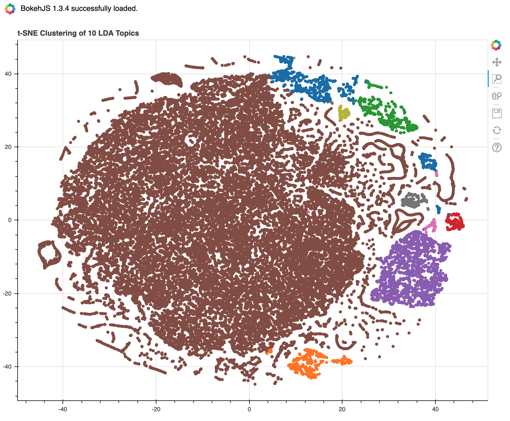

#### 5.3 **Sentiment Analysis of Ford 2017-2018**
* **Distribution of sentiment scores:** At this stage, we are just singling out Ford(F) for some exploratory analysis. Applying Vader Lexicon, we generated the positive, negative sentiment scores in our original textual data. Neutral score has been omitted for readability of the graph.

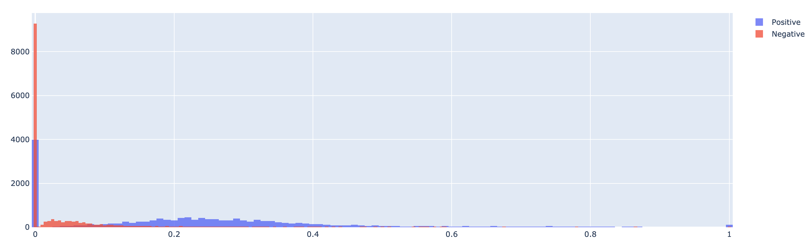

* **Distribution of sentiment scores of aggregation based on company and month:** What is worth noticing is the lack of varability of positive or negative socres.

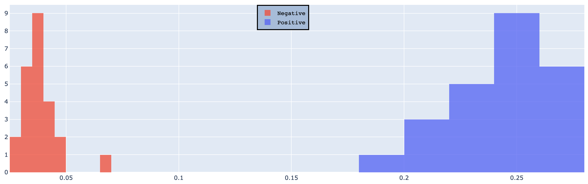

* **Distribution of sentiment scores after text summarization:** We use BERT to summarize the monthly textual data before applying the Vader sentiment analysis. The purpose is to filter through most of the neutral textual data and amplify the positive and negative scores. As expected, the resultant distribution has a much imporved spread of sentiment scores. 

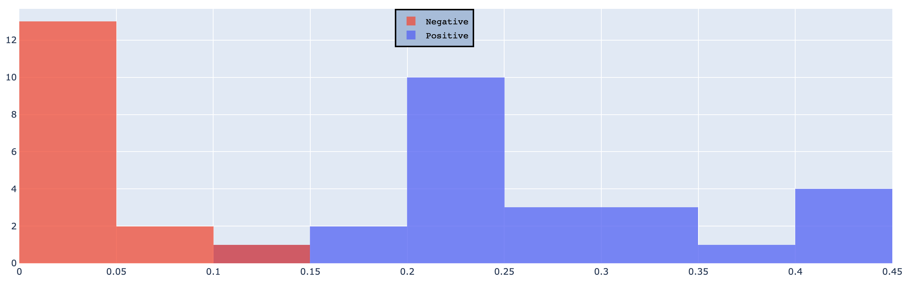

* **Preview of the time series of pricing and sentiment data:** We are plotting out the time series of stock price of Ford along with its sentiment scores. Thanks to text summarization by BERT, the sentiment scores are no longer flat lines due to no variablity. 

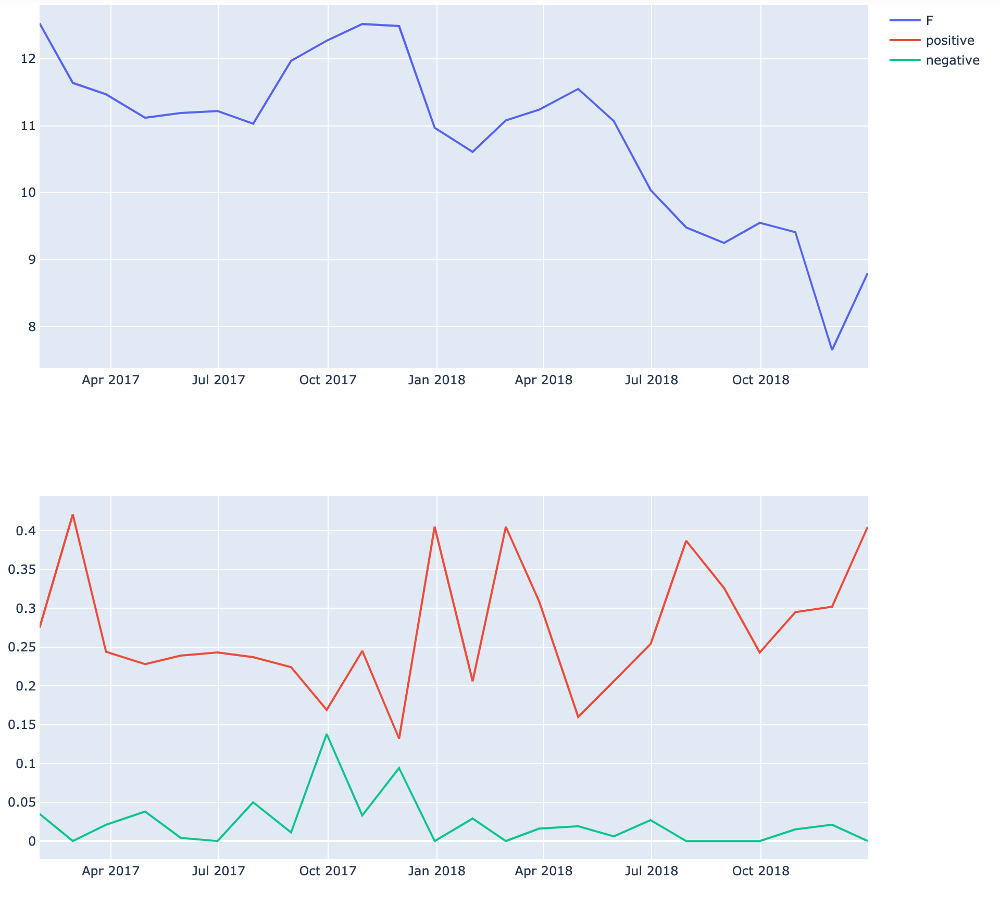

* **Adding moving 12 months average of sentiment scores:** What we concluded from the previous step is that the absolute level of sentiment scores fails to provide directional information on stock price. We are calculating the 12 months moving average on sentiment scores. The trading hypothesis is based on the relative strength of sentiment scores with a contrarian twist: 
1. If positive score is above its moving average and negative score is below its moving average, we are taking a short position on the stock. 
2. If positive score is below its moving average and negative score is above its moving average, we are taking a long position on the stock.
3. Otherwise, we keep holding our positions from previous period. 

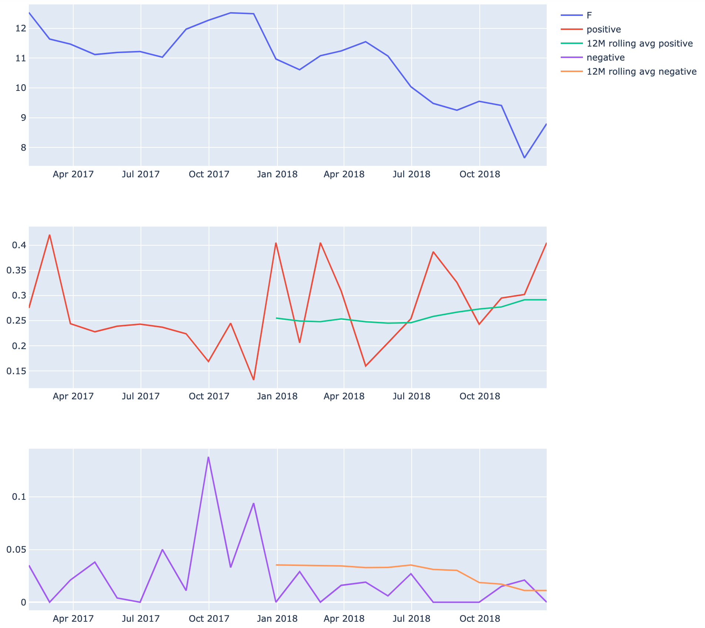

* **Preview of the trading strategy:** 
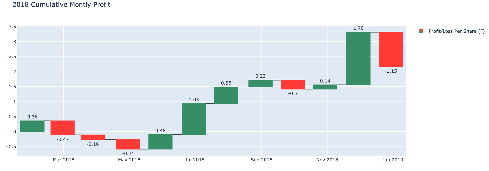

## 6. Modeling

#### 6.1. Method

The problem eseentially boils down to classification: to predict whether the stock is going up or down. Below are the classification models explored in this report:

1. **Logistic Regression:** The simplest classification model.
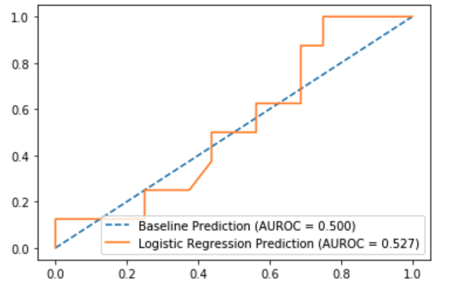

2. **Gaussian Naive Bayes:** Relatively simple but can be really powerful sometimes.

3. **Desicion Tree:**
3.1. **Desicion Tree with Entropy:**
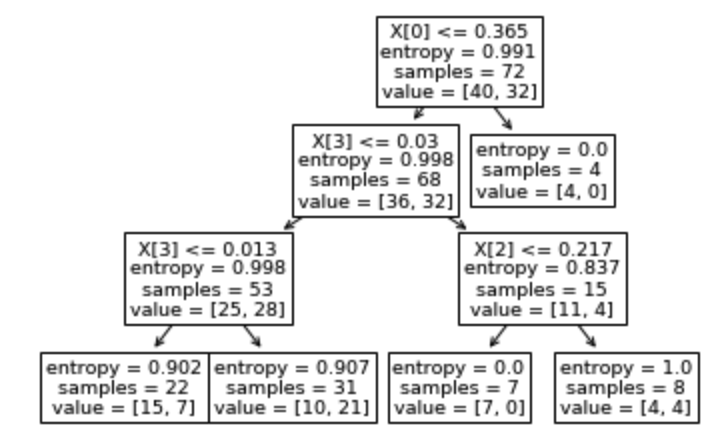

3.2. **Desicion Tree with Gini:**

4. **Random Forest:**
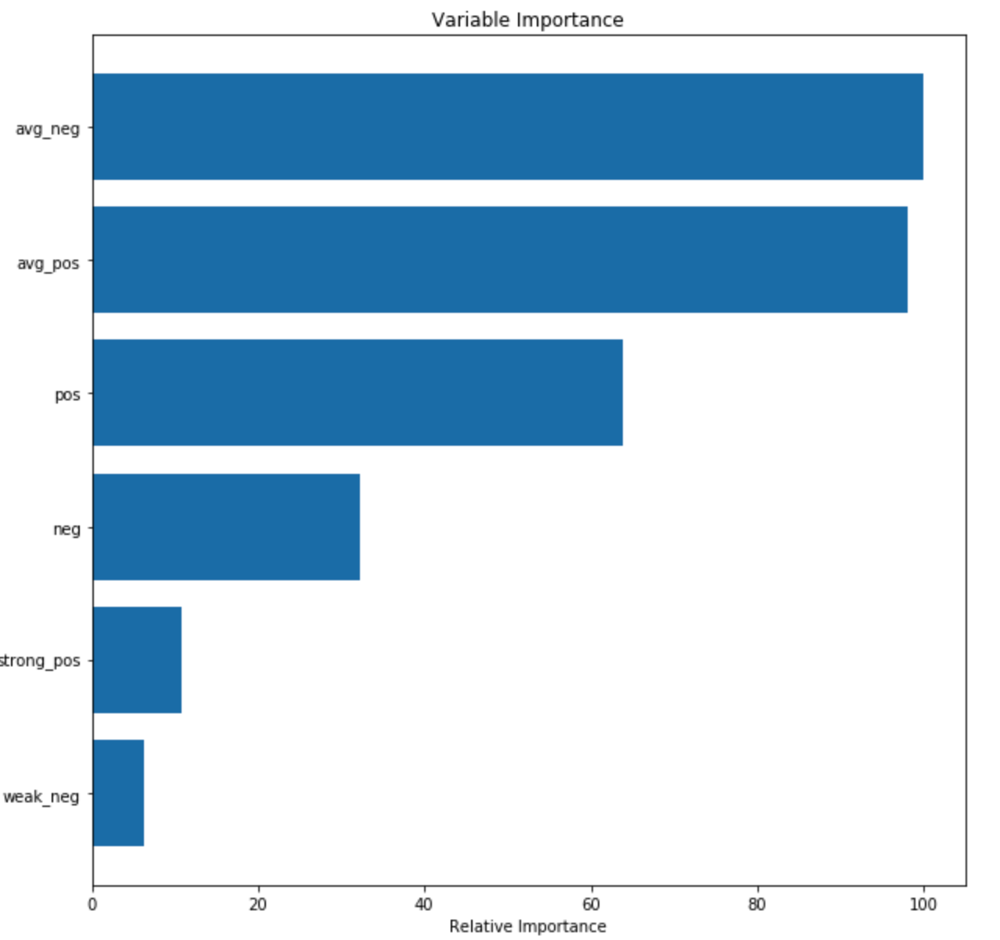

5. **Random Forest Gradient Boost:**

6. **Random Forest XG Boost:**

**WINNER:Gaussian Naive Bayes** 

I chose Gaussian Naive Bayes due to its simplicity and relatively high accuracy.

#### 6.2. Hyperparameter Tuning

###### 6.2.1. Grid Search Cross Validation

I applied GridSearchCV on Random Forest Regressor. Due to the time and resource constraints, I only varied one hyperparameter: n_estimators from 100 to 1100 at the interval of 100. In the end, the best parameter for n_estimators is 500. 

###### 6.2.2. Randomized Search Cross Validation

Here I was able to apply a set of parameters to search through. As a result of that, I implemented randomized search cross validation on Random Forest Regressor XGboost with the below parameter set:

  * 'colsample_bytree':[0.4, 0.6, 0.8]
  * 'gamma':[0, 0.03, 0.1, 0.3]
  * 'min_child_weight':[1.5, 6, 10]
  * 'learning_rate':[0.05, 0.1]
  * 'max_depth':[3,5,7]
  * 'n_estimators':[500]
  * 'reg_alpha':[1e-5, 1e-2,  0.75, 1]
  * 'reg_lambda':[1e-5, 1e-2, 0.45, 1, 1.5, 2]
  * 'subsample':[0.6, 0.95] 

#### 6.3. Model Evaluation Metrics

*MAE: mean of the absolute value of errors

*RMSE : squared root of the mean of the squared errors.

Method | RMSE
------------ | -------------
Random Forest Regressor| 1.3959306170693693
Random Forest Regressor XGB | 2.347896772001473
Random Forest Regressor XGB with Randomized Search CV | 1.281564628227814

>***NOTE:** I choose RMSE as the accuracy metric over mean absolute error(MAE) because the errors are squared before they are averaged which penalizes large errors more. Thus, the RMSE is more desirable when the large errors are unacceptable. The lower the RMSE, the better the prediction because the RMSE takes the square root of the residual errors of the line of best fit.*

## 7. Future Improvements

* SVM: use Kernel Trick along with other hyperparameter tuning to evaluate the accuracy of the model with respect to the aforementioned methods. 

* Bayesian Optimization: compare the efficacy and efficiency using Bayesian Optimization to Randomized Search Cross Validation.

* Due to RAM constraints, I had to train a 10% sample of the original dataset. Without resource limitations, I would pursue training on the full dataset. Preliminary tests showed that the bigger the training size, the lower the RMSE. 

## 8. Credits

Thanks to Jeremy Cunningham for being an amazing Springboard mentor.
