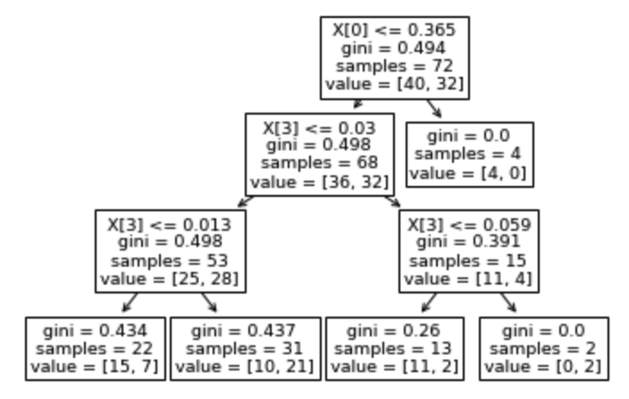

## NLP Sentiment Analysis on Transcripts Data

## 1. Problem Identification

#### 1.1. Background: Corporate Transcripts

*[S&P Global](https://www.spglobal.com/marketintelligence/en/documents/spglobal_transcripts-textual-data-analytics-brochure.pdf) provides unstructured textual data in machine-readable format with metadata tagging for quicker analysis. The transcripts of call data range from earnings, M&A, guidance to special calls and conferences.

With rapid development in Natural Language Processing field, more sophisticated tools have been introduced, such as SpaCy, Gensim, BERT and a plethora of sentiment analysis packages in NLTK (Vader, etc). This project takes advantage of the recent breakthrough in NLP and applies the technique on the transcripts data offered by S&P Global from 2017 to 2018. [NLP](https://en.wikipedia.org/wiki/Natural_language_processing)*

#### 1.2 Problem Statement

In this project, my goal is to create a trading strategy based on the sentiment analysis on company's transcripts.

## 2. Data Wrangling

#### 2.1. Data Collection

The NLP dataset contains S&P 100 companies' transcripts data from 2017 to 2018. The schema of the dataset is straightforward: companyID, date, and textual content. The stock data is obtained through Yahoo Finance Python API. 

#### 2.2. Data Definition

I investigated the below features with the help of info(), describe(), and panda profiling. 

    1.	Column Name
    2.	Data Type (numeric, categorical, timestamp, etc)
    3.	Description of Column
    4.	Count or percent per unique values or codes (including NA)
    5.	The range of values or codes

## 3. Data Cleaning

* **Problem 1:** Handling missing data. **Solution:** there is no missing data in the datasets. 

* **Problem 2:** Removing duplicates. **Solution:** use the built in Pandas DataFrame function drop_duplicates(). 

## 4. Pre-processing and Feature Engineering

    •	Create dummy or indicator features for categorical variables
    •	Standardize the magnitude of numeric features: minmax or standard scaler
    •	Split into testing and training datasets

## 5. Exploratory Data Analysis

#### 5.1 **pyLDAvis:** 
* LDA(Latent Dirichlet Allocation) assumes documents produced from a specific topic follow their own probability distribution of words. Given a dataset of documents, LDA backtracks and analyzes the underlying words discribution to figure out what topics would create those documents. Here I use the popular pyLDAvis to present 10 topics embedded in transcripts data.

#### 5.2 **t-SNE:** 
* t-SNE(t-Distributed Stochastic Neighbor Embedding), similar to PCA, is a technique for dimensionality reduction that is particularly well suited for the visualization of high-dimensional datasets. Below is the application of visualizing 10 topics:

#### 5.3 **Sentiment Analysis of Ford 2017-2018**
* **Distribution of sentiment scores:** At this stage, we are just singling out Ford(F) for some exploratory analysis. Applying Vader Lexicon, we generated the positive, negative sentiment scores in our original textual data. Neutral score has been omitted for readability of the graph.

* **Distribution of sentiment scores of aggregation based on company and month:** What is worth noticing is the lack of varability of positive or negative socres.

* **Distribution of sentiment scores after text summarization:** We use BERT to summarize the monthly textual data before applying the Vader sentiment analysis. The purpose is to filter through most of the neutral textual data and amplify the positive and negative scores. As expected, the resultant distribution has a much improved range of sentiment scores. 

* **Preview of the time series of pricing and sentiment data:** We are plotting out the time series of stock price of Ford along with its sentiment scores. Thanks to text summarization by BERT, the sentiment scores are no longer flat lines due to no variablity. 

* **Adding moving 12 months average of sentiment scores:** What we concluded from the previous step is that the absolute level of sentiment scores fails to provide directional information on stock price. We are calculating the 12 months moving average on sentiment scores. The trading hypothesis is based on the relative strength of sentiment scores with a contrarian twist: 
1. If positive score is above its moving average and negative score is below its moving average, we are taking a short position on the stock. 
2. If positive score is below its moving average and negative score is above its moving average, we are taking a long position on the stock.
3. Otherwise, we keep holding our positions from previous period. 

* **Preview of the trading strategy:** Below is the cumulative return of Ford in 2018 based on the aforementioned trading strategy.

## 6. Modeling

#### 6.1. Method

The problem essentially boils down to classification: to predict whether the stock is going up or down. Below are the classification models explored in this project:

1. **Logistic Regression:** Let's start with the simplest classification model. Model evaluation is based on ROC AUC score. Here it is 0.527 for the first model.

2. **Gaussian Naive Bayes:** Relatively simple but can be really powerful sometimes. The ROC AUC score is 0.613.

3. **Desicion Tree:**
3.1. **Desicion Tree with Entropy with Max Depth of 3:** The ROC AUC score is 0.543.

3.2. **Desicion Tree with Gini with Max Depth of 3:** The ROC AUC score is 0.527.

4. **Random Forest:** The ROC AUC score is 0.617. A feature importance analysis shows that the top two features are moving average negative scores and moving average positive scores. It reinforces our belief that the relative level matters more than the absolute level of sentiment scores.

5. **Random Forest Gradient Boost:** The ROC AUC score is 0.633. The model has below parameters: 

    * n_estimators=20
    * learning_rate = 0.5
    * max_features=2
    * max_depth = 2
    * random_state = 0

**WINNER: Gaussian Naive Bayes** 

We chose Gaussian Naive Bayes due to its simplicity and relatively high ROC AUC accuracy.

#### 6.2. Hyperparameter Tuning

###### 6.2.1. Grid Search Cross Validation on Random Forest Gradient Boost

We applied GridSearchCV on Random Forest Gradient Boost. 

  * 'learning_rate': (0.05, 0.1, 0.25, 0.5, 0.75, 1)
  * 'max_depth':np.arange(1,5)
  * 'n_estimators':np.arange(20,100,20)
  * 'max_features':np.arange(2,6,1)
  * 5 fold cross validation
  
  
Result of Best Parameters: {'learning_rate': 0.05, 'max_depth': 1, 'max_features': 4, 'n_estimators': 20} with score of 0.634.

###### 6.2.2. Grid Search Cross Validation on Random Forest XG Boost

We implemented grid search cross validation on Random Forest XGboost with the below parameter set:

     * "eta"              : [0.05, 0.10, 0.15, 0.20, 0.25, 0.30] 
     * "max_depth"        : [ 3, 4, 5, 6, 8, 10, 12, 15]
     * "min_child_weight" : [ 1, 3, 5, 7]
     * "gamma"            : [ 0.0, 0.1, 0.2, 0.3, 0.4]
     * "colsample_bytree" : [ 0.3, 0.4, 0.5, 0.7]
     * 3 fold cross validation
     
Result of Best Parameters: {'colsample_bytree': 0.3, 'eta': 0.05, 'gamma': 0.0, 'max_depth': 3, 'min_child_weight': 7} with score of 0.637.  

#### 6.3. Model Evaluation Metrics: A summary of all the methods

*AUC ROC Score

Method | AUC ROC Score
------------ | -------------
Logistic Regression | 0.527
Gaussian Naive Bayes | 0.613
Decision Tree (Entropy) | 0.543
Decision Tree (Gini) | 0.527
Random Forest | 0.617
Random Forest Gradient Boost | 0.633
Random Forest Gradient Boost with Grid Search CV | 0.634
Random Forest XGB with Grid Search CV | 0.637

## 7. Future Improvements

* SVM: use Kernel Trick along with other hyperparameter tuning to evaluate the accuracy of the model with respect to the aforementioned methods. 

* Random Search Cross Validation and Bayesian Optimization: compare the efficacy and efficiency using Bayesian Optimization and Randomized Search Cross Validation to Grid Search Cross Validation.

* Due to resource constraints, I had to train a sample of 5 stocks (Facebook, Amazon, Apple, Netflix and Google) for two years (2017 and 2018). Without resource limitations, I would pursue training on the S&P 500 stocks for a longer time horizon.

## 8. Credits

Thanks to Jeremy Cunningham for being an amazing mentor!
